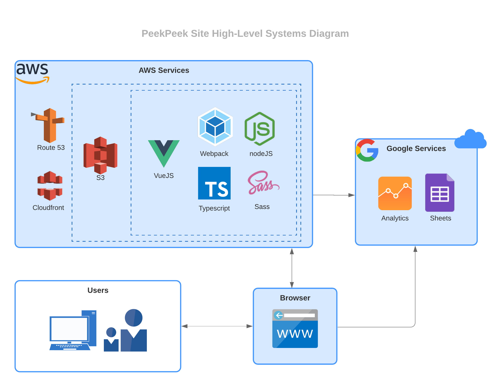
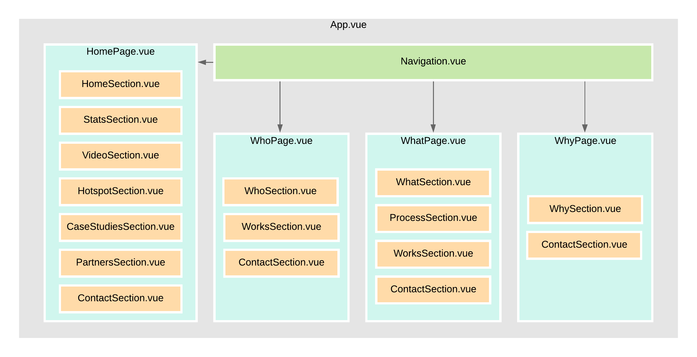

# PeekPeek

## Contents
<!-- MarkdownTOC autolink="true" -->

- [Getting Started](#getting-started)
    - [Requirements & Dependencies](#requirements--dependencies)
    - [Development Setup](#development-setup)
    - [Development Notes](#development-notes)
- [Deployment](#deployment)
    - [S3 Initialization](#s3-initialization)
    - [Configuring Sheet DB](#configuring-sheet-db)
            - [Notes on Sheet DB:](#notes-on-sheet-db)
    - [Pushing Project to S3 Bucket](#pushing-project-to-s3-bucket)
- [Technology Architecture](#technology-architecture)
- [Section Breakdown](#section-breakdown)
    - [Modifying Text, Images and Other Assets](#modifying-text-images-and-other-assets)
        - [Directly on the HTML](#directly-on-the-html)
        - [On Templates](#on-templates)
- [Recommendations for Future Updates](#recommendations-for-future-updates)
- [Other Notes](#other-notes)
- [Copyright and Licensing Information](#copyright-and-licensing-information)
- [Developer Contact Information](#developer-contact-information)
- [Useful References](#useful-references)

<!-- /MarkdownTOC -->


## Getting Started

### Requirements & Dependencies
- Node & npm
- Vue-CLI
- S3 or any other static website hosting service
- an active Google Spreadsheet document (for the Contact Form)
- [Sheet DB](https://sheetdb.io/)

### Development Setup
1. Install node & npm
    On MacOS:
    On Windows:
    On Ubuntu:
        ```
            $ sudo apt update
            $ curl -sL https://deb.nodesource.com/setup_10.x | sudo -E bash -
            $ sudo apt install nodejs
            $ node --version
            $ npm --version
        ```
2. Install Vue-CLI globally: `npm install -g vue-cli`
3. Go to project directory, and install project dependencies with: `npm install`
4. Start the local development server: `npm run serve`
5. You can view the site through the browser on `localhost:8080`

### Development Notes
- You can use your preferred IDE to modify code.
- To lint the project and fix errors in formatting, run the command `npm run lint`.
- Once the local development server has started, any changes on the local project will update localhost immediately through hot-reloading.

## Deployment

### S3 Initialization
_More details can be found in AWS documentations (link below)_
1. Create an S3 Bucket
2. Set the S3 Bucket as public and enable ***Static Website Hosting***
3. If setting up the bucket for production, make sure to point the domain (with Route53 & CloudFront) to the appropriate S3 bucket.
4. If pushing code directly from one's local machine, make sure machine has `aws-cli` installed with permissions configured. 

### Configuring Sheet DB 
1. Create/Log in to the [Sheet DB](https://sheetdb.io/) account.
2. Create a Google Spreadsheet with the following headers set up (case-sensitive):
   - Industry
   - Location 
   - Name 
   - Email
   - Phone
   - Inquiry
3. Generate an API URL that is connected to the sheet created in step 2.
4. Make sure the API only allows `POST` requests. (disable all other types of requests)
5. In `ContactForm.vue`, look for the line containing the API call and replace the URL.
   ```javascript
      Vue.axios.post('<place URL here>', save);
   ```

##### Notes on Sheet DB:
  - This can be done once, unless intending to generate multiple URLs in order to maintain free status.
  - The edits to the sheet will be under the name of the account holder of the API URL.


### Pushing Project to S3 Bucket
1. Build the project
    ```bash
        $ npm run build
    ```
2. Push the project `dist` folder (generated by the build) to the S3 bucket
    ```bash
        $ aws s3 cp dist/ s3://<S3 bucket name> --recursive
    ```


## Technology Architecture



The image above shows a high-level overview of the system and the technologies used/surrounding the site. 

The site is fully front-end. There is no dependency for a standalone web server to host the site. Thus, the site can hosted on any platform that supports static website hosting (i.e. S3). The contact form stores information to a Google Spreadsheet, since the site does not maintain its own database. This is to ensure the site remains lightweight, since it doesn't maintain its own server.

The main code in this repository is written in VueJS using Vue-CLI and the `vue-property-decorator` library.


## Section Breakdown



The figure above shows how all the pages have been divided into sections (as components). In addition to those sections, there are other components that are being called from those sections that are included in the overview, since the main section components are simply using them.

### Modifying Text, Images and Other Assets

It is recommended to modify the text or asset directly in whichever Page/Section vue file that owns the particular text. Searching for files under `/src` for any text that needs to be changed would be the most helful. In this section, we will simply cover general patters in which texts and other assets are displayed:

#### Directly on the HTML

Some HTML may look like this:
```vue
<h2 class="heading">
    <span class="line">Seeing is&nbsp;</span>
    <span class="line">believing</span>
</h2>
<p class="primary-description">90% of customers make purchase decisions based on a website's visual content alone.</p>
<p class="primary-description">Impress engage and impace potential customers by adding PeekPeek's 360&deg; virtual reality tour to your website. With our results, we could be the best tool in your toolbox</p>
<h3 id="button-prompt">New challenge?</h3>
<a id="solution-button" class="button primary-button" href="/who">New solution</a>
```

For cases where the texts/assets are directly placed on the HTML, simply changing the text inside the tags is suffice to change the text on the page.

#### On Templates

Some HTML have been templated for the case where the component may be reused in other sections/pages. These are usually denoted with curly brakets, and the actual text would be in the component that uses the template.

As in the case of the texts in `ContactSection.vue`:
```vue
<div class="contact-section-interlude">
    <h2 class="subheading">{{ interludeText }}</h2>
</div>
<div class="contact-section-main">
    <h2 class="heading">{{ headingTextLine1 }}</h2>
    <h2 class="heading">{{ headingTextLine2 }}</h2>
<button class="primary-button" @click="onContactButtonClick">{{ contactUsButtonText }}</button>
</div>
```

The variables inside the brackets are replaced with the actual string as defined by the page that reuses the component with the template. The actual text will be the typescript/javascript section of the component.

Example, in `WhatPage.vue`:
```javascript
data() {
    return {
        headingTitle: "Featured Work",
        interludeText: "Can you tell me more",
        headingTextLine1: "about what",
        headingTextLine2: "you do?",
        contactUsButtonText: "Get quote"
    };
}
```

`interludeText`, `headingTextLine1`, `headingTextLine2` and `contactUsButtonText` will be replaced by their corresponding text.


## Recommendations for Future Updates
If this project were to be imrpoved further in the future, the following are areas in which improvement can be done. __Note: These suggestions mostly pertain the code itself and performance in general. All functionality have already been implemented.__
- Code Cleanup
  - Some comments were kept in order to show examples of alternatives and future TODOs. These can be removed if deemed unnecessary or not applicable anymore.
- Fix the way parallax effects are currently implemented (can be simplified further)
  - Currently, parallax effects are implemented on a per page basis. Each page has its own configuration for initializing scrollmagic.
  - One way to prevent the repetition would be to move the initialization to `common.ts` 
- Optimize scroll effects with throttling
  - lodash has a method for throttling scroll events to prevent redrawing on every tick
- More fluid breakpoints
  - While the site is responsive in most cases, it would not hurt to have more breakpoints, so the fluidity of the design would be more consistent.


## Other Notes
- To keep the project organized, it is recommended you put any images you want on the website inside the folder under `./src/assets/images/`. If this is done, then changing a specific picture will only require changing the filename and not the entire path.

- On Animation Tweens:
  - If a tween isn’t moving even though the console isn’t throwing any errors, then the most likely scenario is that the element does not have an ID. If the element doesn’t have an ID, then scrollmagic can’t add styling to it.

- On CSS Precedence:
  - If you make a change to the CSS, and it doesn’t effect the element, make sure that there are no `!important` attributes being assigned to that element. Some breakpoints set attributes as “!important” to override traditional css precedences
  - All Page type vue SCSS are `scoped` (Contact section is also scoped). If you make a CSS change, given that the correct selectors were provided, it may also be due to scoping issues. You can use the `v-deep` directive to mitigate these issues.


## Copyright and Licensing Information
This project was completed in accordance to the rules and regulations set upon students completing their project at the University of California, Irvine. Since the website was completed for credit as part of a college course, the programmers/designers do not hold any rights related to the code used to create this project. For all NPM libraries, please refer to package.json for a full list of licensing information from all libraries used.

## Developer Contact Information
[Jonathan Bui](mailto:jhbui1@uci.edu), [Ken Cue](mailto:kcue@uci.edu), [Thu Hyunh](mailto:thuah@uci.edu), [Sazeda Sultana](mailto:sazedas@uci.edu), [Glen Wu](mailto:haiminw@uci.edu)

## Useful References 
- [Vue CLI Configuration Reference](https://cli.vuejs.org/config/)
- [Vue Property Decorator](https://github.com/kaorun343/vue-property-decorator)
- [ScrollMagic](https://scrollmagic.io/)
- [GreenSock Animation Plugin](https://greensock.com/)
- [Anime.JS](https://animejs.com/)
- [AWS Documentation](https://docs.aws.amazon.com/)
- [Sheet DB](https://sheetdb.io/)
